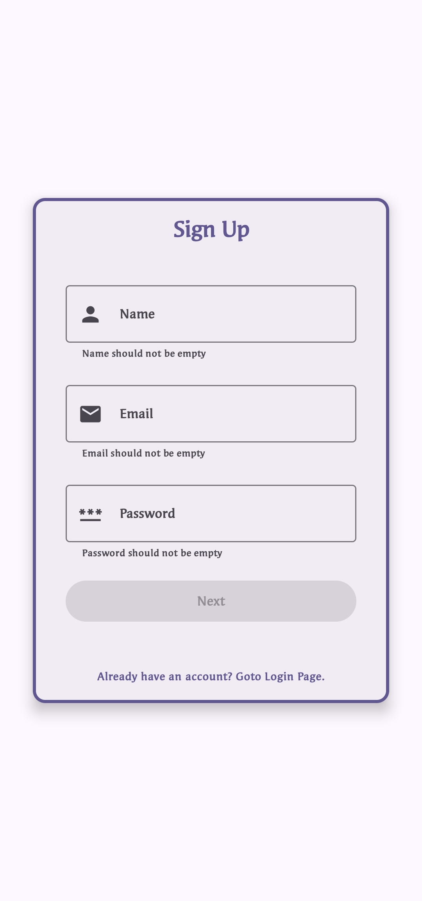
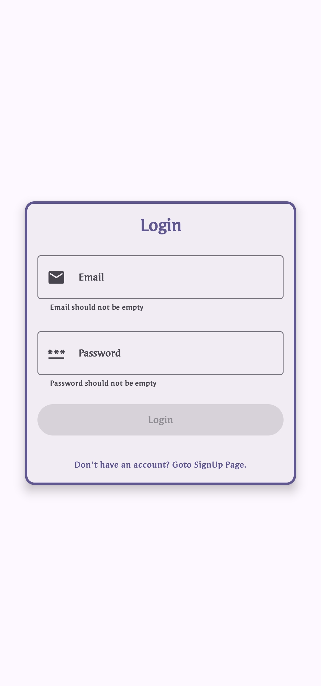
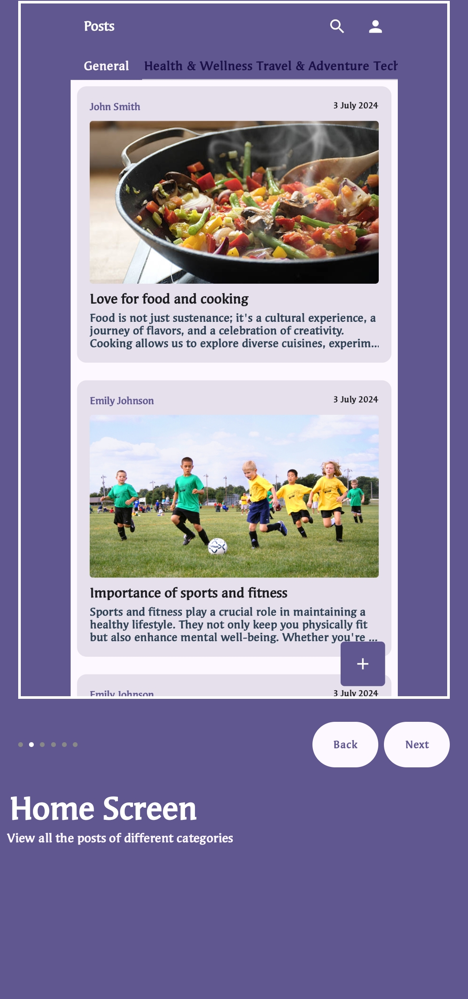
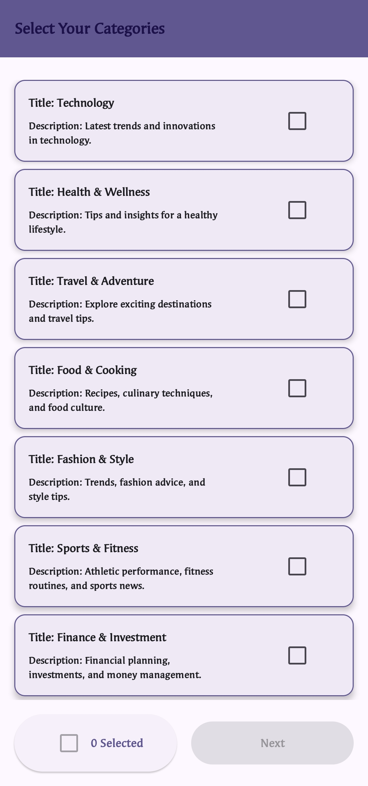
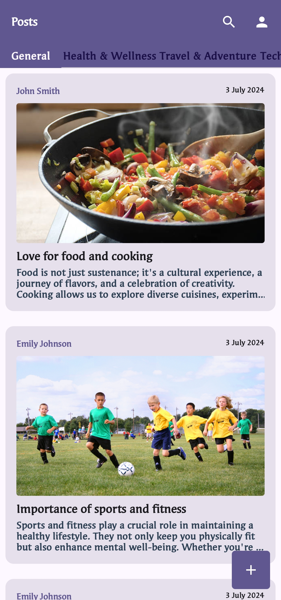
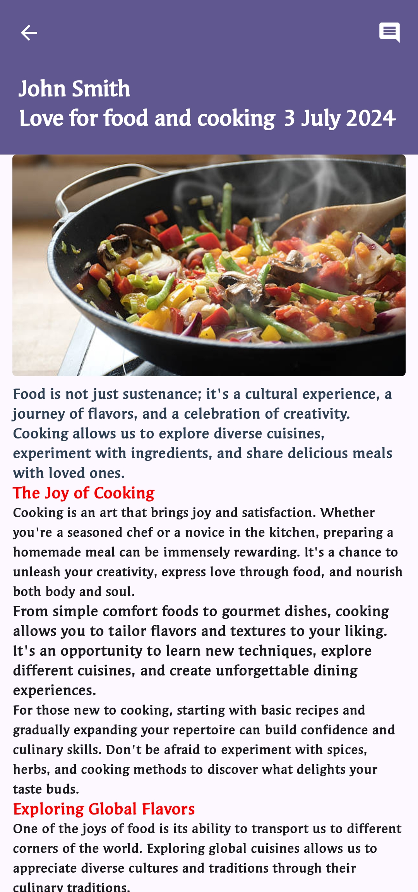
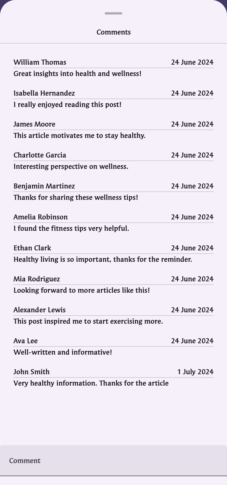
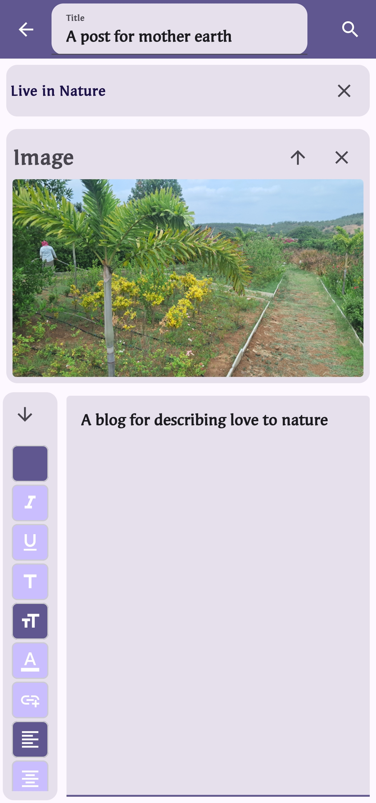
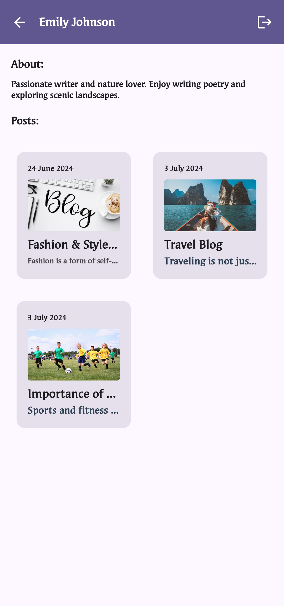

# Blog App Android Project

Welcome to the Blog App Android Project repository! This project utilizes Jetpack Compose for building a modern Android blogging application.

## Features

- **Login and Signup**: Secure authentication flow for users.
- **Adding Posts**: Create and publish new blog posts.
- **Categories**: Categorize posts for easy navigation.
- **Home Screen**: Main interface for navigating posts.
- **Post Viewer Page**: Read full posts with comments.
- **Add Post Page**: Utilizes a rich text editor for creating posts.
- **Comments**: Ability to add and view comments on posts.
- **Profile Page**: View user-specific posts and information.

## Project Setup

### Prerequisites

- Android Studio
- Kotlin 1.5.0 

### Getting Started

1. **Clone the Repository**
   ```bash
   git clone https://github.com/toshit-dh/blog-app-android.git
   ```

2. **Open in Android Studio**
    - Open Android Studio.
    - Navigate to `File > Open` and select the cloned directory.

3. **Configure Backend**
    - The app communicates with the backend hosted at [Blog App Backend](https://github.com/toshit-dh/blog-app-backend).
    - Follow the setup instructions in the backend repository to configure and run the server.

4. **Run the App**
    - Connect your Android device or use an emulator.
    - Click on the green play button in Android Studio to build and run the app.

### Libraries Used

- **Dagger Hilt**: Dependency injection framework for Android.
- **Rich Text Editor**: Allows users to format text in posts.
- **Coil**: Image loading library for Android.
- **DataStore Preferences**: Modern data storage solution.
- **Retrofit**: HTTP client for Android and Kotlin.

For more details, please refer to the [Blog App Backend](https://github.com/toshit-dh/blog-app-backend) repository.

## Screenshots











